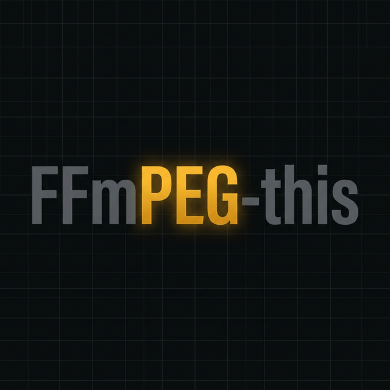

# PEG-this Website

The official landing page for **[PEG-this](https://github.com/hariharen9/ffmpeg-this)** — FFmpeg, but you'll actually use it.

This repository contains the source code for the PEG-this web application, beautifully crafted with modern web technologies, smooth scrolling, and custom animations.



## 🚀 Technologies Used

- **React 18** — Component-driven UI architecture
- **Vite** — Lightning-fast build tool and dev server
- **CSS Modules** — Locally scoped, modular styling to ensure a clean codebase
- **Lenis** — Buttery smooth scroll mechanics
- **Vanilla CSS** — Custom design tokens and interactive animations without heavy, bloated CSS frameworks

## 🛠️ Local Development

To run this project locally, ensure you have [Node.js](https://nodejs.org/) installed.

1. **Clone the repository:**
   ```bash
   git clone https://github.com/hariharen9/pegthis-website.git
   cd pegthis-website
   ```

2. **Install dependencies:**
   ```bash
   npm install
   ```

3. **Start the development server:**
   ```bash
   npm run dev
   ```

4. **Launch the site:**
   Navigate to `http://localhost:5173` in your browser.

## 🏗️ Build for Production

To create a highly-optimized static build ready for deployment (such as Vercel, Netlify, or GitHub Pages):

```bash
npm run build
```

The compiled and minified production files will be output to the `dist/` directory.

## 🤝 Contributing

Feel free to open issues or submit pull requests for any design improvements or bugs you find on the website!

*Note: For issues or contributions related to the actual `peg_this` Python CLI tool itself, please visit the [main ffmpeg-this repository](https://github.com/hariharen9/ffmpeg-this).*
